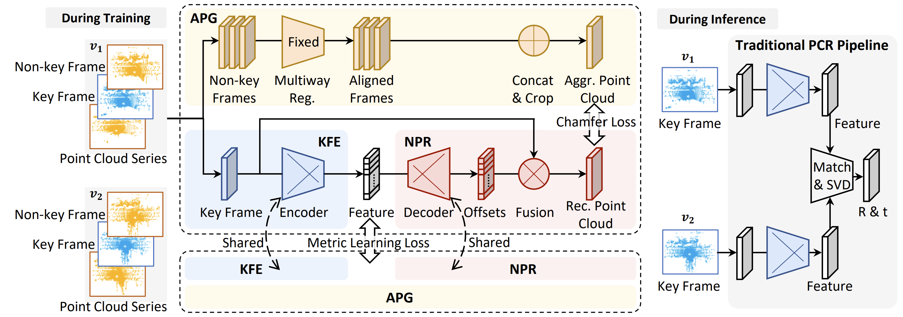

# APR: Online Distant Point Cloud Registration Through Aggregated Point Cloud Reconstruction (IJCAI'23)

[](https://paperswithcode.com/sota/point-cloud-registration-on-kitti-distant-pcr?p=apr-online-distant-point-cloud-registration)
[](https://paperswithcode.com/sota/point-cloud-registration-on-nuscenes-distant?p=apr-online-distant-point-cloud-registration)

For many driving safety applications, it is of great importance to accurately register LiDAR point clouds generated on distant moving vehicles. However, such point clouds have extremely different point density and sensor perspective on the same object, making registration on such point clouds very hard. In this paper, we propose a novel feature extraction framework, called APR, for online distant point cloud registration. Specifically, APR leverages an autoencoder design, where the autoencoder reconstructs a denser aggregated point cloud with several frames instead of the original single input point cloud. Our design forces the encoder to extract features with rich local geometry information based on one single input point cloud. Such features are then used for online distant point cloud registration. We conduct extensive experiments against state-of-the-art (SOTA) feature extractors on KITTI and nuScenes datasets. Results show that APR outperforms all other extractors by a large margin, increasing average registration recall of SOTA extractors by 7.1% on LoKITTI and 4.6% on LoNuScenes.

Camera-ready:[https://www.ijcai.org/proceedings/2023/134](https://www.ijcai.org/proceedings/2023/134)
Arxiv: [https://arxiv.org/abs/2305.02893](https://arxiv.org/abs/2305.02893)

## News

20230720 - Our new advancement, GCL (ICCV 2023), achieved up to 40% RR increase on KITTI long range scenarios! Be sure to also [check it out](https://www.github.com/liuQuan98/GCL)!

20230508 - Source code and pretrained weights are released.

20230420 - Our paper has been accepted by IJCAI'23!

## Aggregated Point Cloud Reconstruction (APR)


Traditional feature extractors dedicated to registration take in point clouds and output point-wise features. We propose to extend the workflow to treat the original feature extractor as the encoder (Key-frame Feature Extractor, KFE) of an autoencoder structure, while the decoder (Non-key-frame Point-cloud Reconstruction, NPR) decodes an accumulated denser environmental point cloud, i.e., the Aggregated Point Cloud. It is obtained by accumulating the past and future frames around a key frame (in Aggregated Point-cloud Generation, APG). The encoder is encouraged to enhance its feature representativeness in order to allow the decoder to guess the dense from the sparse, and infer the complete from the incomplete. Please refer to the paper for a detailed description.

<div align="center">

</div>

This is a typical Aggregated Point Cloud (in blue) versus the corresponding key frame (in orange).

## Important notes before you proceed

This repository is a combination of two separate implementation of APR, one upon FCGF and another upon Predator. **During the execution of both methods, please treat `./FCGF_APR` or `./Predator_APR` as the working directory.**

**For method-specific execution instructions, please refer to the README.md files in the child directories, including [FCGF_APR](./FCGF_APR/README.md) and [Predator_APR](./Predator_APR/README.md).**

## Requirements

- Ubuntu 14.04 or higher
- CUDA 11.1 or higher
- Python v3.7 or higher
- Pytorch v1.6 or higher
- [MinkowskiEngine](https://github.com/stanfordvl/MinkowskiEngine) v0.5 or higher

## Dataset Preparation

### KITTI

For KITTI dataset preparation, please first follow the [KITTI official instructions](https://www.cvlibs.net/datasets/kitti/eval_odometry.php) to download the 'velodyne laser data', 'calibration files', and (optionally) 'ground truth poses'.

Since the GT poses provided in KITTI drift a lot, we recommend using the pose labels provided by [SemanticKITTI](http://www.semantic-kitti.org/dataset.html#download) instead, as they are more accurate. Please follow the official instruction to download the split called 'SemanticKITTI label data'.

Extract all compressed files in the same folder and we are done. We denote KITTI_ROOT as the directory that have the following structure: `{$KITTI_ROOT}/dataset/poses` and `{$KITTI_ROOT}/dataset/sequences/XX`.

The option to use KITTI original pose is still preserved which can be enabled by setting `use_old_pose` to True in the scripts for FCGF_APR (or config files for Predator_APR), although we highly discourage doing so due to performance degredation. Please note that all of the methods reported in our paper are retrained on the label of SemanticKITTI instead of OdometryKITTI.

### nuScenes

The vanilla nuScenes dataset structure is not friendly to the registration task, so we propose to convert the lidar part into KITTI format for ease of development and extension. Thanks to the code provided by nuscenes-devkit, the conversion requires only minimal modification.

To download nuScenes, please follow the [nuscenes official page](https://www.nuscenes.org/nuscenes#download) to obtain the 'lidar blobs' (inside 'file blobs') and 'Metadata' of the 'trainval' and 'test' split in the 'Full dataset (v1.0)' section. Only LiDAR scans and pose annotations are used in APR.

Next, execute the following commands to deploy [nuscenes-devkit](https://github.com/nutonomy/nuscenes-devkit) and our conversion script:

```
git clone https://github.com/nutonomy/nuscenes-devkit.git
conda create -n nuscenes-devkit python=3.8
conda activate nuscenes-devkit
pip install nuscenes-devkit
cp ./resources/export_kitti_minimal.py ./nuscenes-devkit/python-sdk/nuscenes/scripts/export_kitti_minimal.py
```

Cater the `nusc_dir` and `nusc_kitti_dir` parameter in `./nuscenes-devkit/python-sdk/nuscenes/scripts/export_kitti_minimal.py` line 51 & 52 to your preferred path. Parameter `nusc_dir` specifies the path to the nuScenes dataset, and `nusc_kitti_dir` will be the path to store the converted nuScenes LiDAR data. Start conversion by executing the following instructions:

```
cd ./nuscenes-devkit/python-sdk
python nuscenes/scripts/export_kitti_minimal.py
```

The process may be slow (can take hours).

## Installation

We recommend conda for installation. First, we need to create a basic environment to setup MinkowskiEngine:

```
conda create -n apr python=3.7 pip=21.1
conda activate apr
conda install pytorch=1.9.0 torchvision cudatoolkit=11.1 -c pytorch -c nvidia
pip install numpy
```

Then install [Minkowski Engine](https://github.com/NVIDIA/MinkowskiEngine) along with other dependencies:

```
pip install -U git+https://github.com/NVIDIA/MinkowskiEngine -v --no-deps --install-option="--blas_include_dirs=${CONDA_PREFIX}/include" --install-option="--blas=openblas"
pip install -r ./FCGF_APR/requirements.txt
pip install -r ./Predator_APR/requirements.txt
```

## Train and test

For method-specific instructions and pretrained models, please refer to the README.md files in the child directories, [FCGF_APR](./FCGF_APR/README.md) and [Predator_APR](./Predator_APR/README.md).

## Acknowlegdements

We thank [FCGF](https://github.com/chrischoy/FCGF) and [Predator](https://github.com/prs-eth/OverlapPredator) for the wonderful baseline methods, [Chamferdist](https://github.com/krrish94/chamferdist) for providing the torch-compatible implementation of chamfer loss, and [nuscenes-devkit](https://github.com/nutonomy/nuscenes-devkit) for the convenient dataset conversion code.
